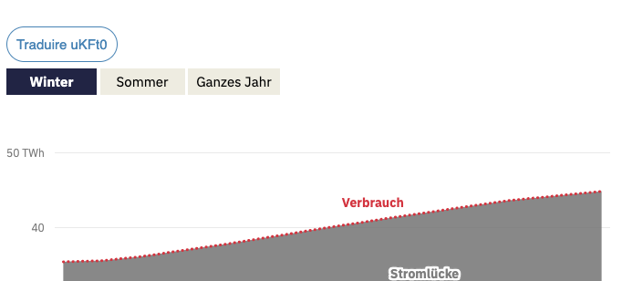

# Datawrapper Bookmarklet: DW Translate

Ajoute des liens pour traduire les graphiques Datawrapper avec l’outil de traduction.

Aperçu:



#### Usage

Copier-coller le code JavaScript du champ ci-dessous dans un nouveau signet:


Rappel: un bookmarklet n’est pas anodin, il peut être utilisé par des pirates pour voler votre session Facebook par exemple. Il ne faut pas exécuter un bookmarklet suspect.

```
javascript: if (window.location.hostname == "datawrapper.dwcdn.net") {
  const dw_id = window.location.href
    .replace("https://datawrapper.dwcdn.net/", "")
    .split("/")[0];
  const dw_translate_url =
    "https://interactif.24heures.ch/dw-translate/#/chart/" + dw_id;
  location.href = dw_translate_url;
} else {
  document.querySelectorAll("iframe").forEach(function (i, j) {
    const src = i.src.toString();
    if (src.indexOf("datawrapper") >= 0) {
      const dw_id = src
        .replace("https://datawrapper.dwcdn.net/", "")
        .split("/")[0];
      const dw_translate_url =
        "https://interactif.24heures.ch/dw-translate/#/chart/" + dw_id;
      let a = document.createElement("a");
      a.innerText = "Traduire " + dw_id;
      a.href = dw_translate_url;
      a.target = "_blank";
      a.style.textDecoration = 'none';
      a.style.padding = '1rem';
      a.style.border = '1px solid steelblue';
      a.style.borderRadius = '99px';
      a.style.display = 'inline-block';
      a.style.color = 'steelblue';
      a.style.fontSize = '1.5rem';
      a.style.fontFamily = 'sans-serif';
      i.parentNode.insertBefore(a, i);
    }
  });
}

```

